# SOM Election Platform 🗳️


**A modern, secure, and transparent electronic voting system designed for Somalia.**

This platform facilitates the entire electoral process, from voter registration and candidate management to real-time voting and results visualization. Built with a focus on integrity, accessibility, and user experience.

---

## 📸 Project Screenshots

Please ensure your screenshots are named as follows in the `screenshots/` folder:

| **Public Portal** | **Candidate Profile** |
|:---:|:---:|
|  | 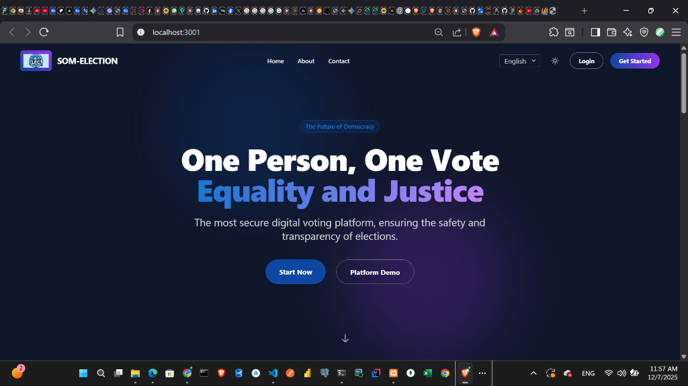 |
| *Dynamic Hero & Showcase* | *Full Candidate Manifesto* |

| **Authentication** | **Communication** |
|:---:|:---:|
| 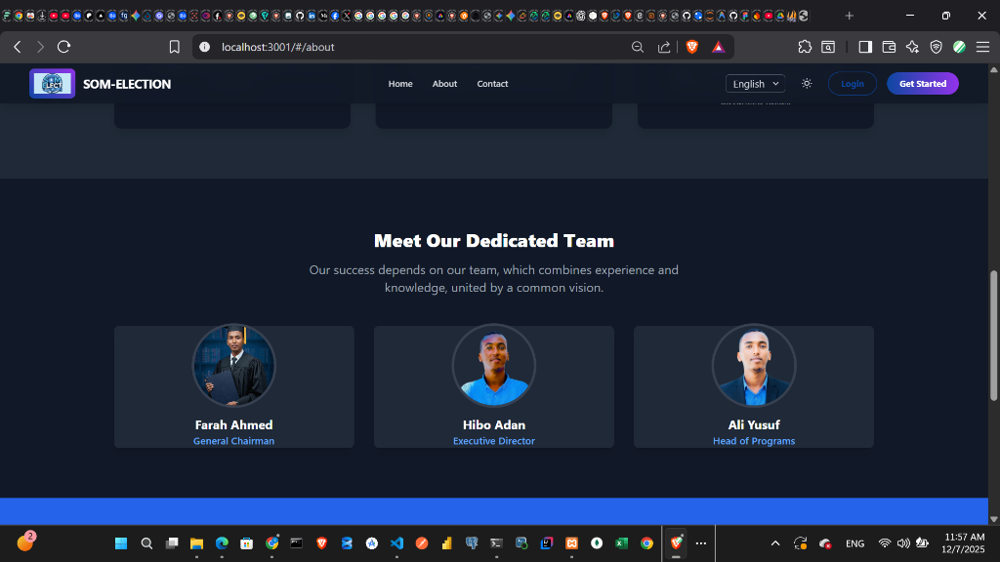 | 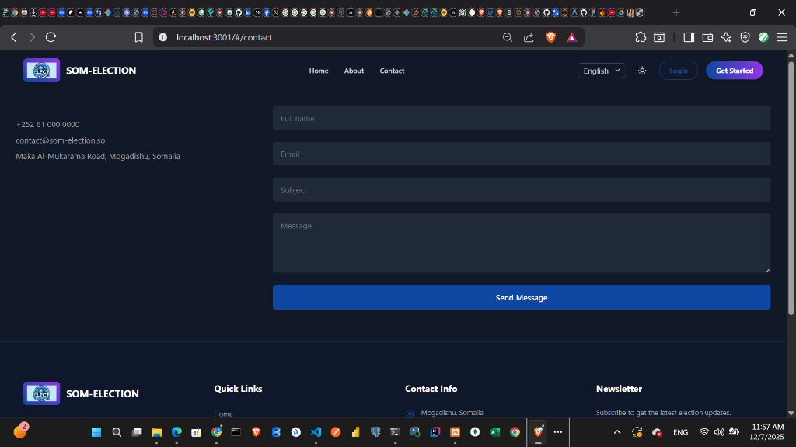 |
| *Secure Unified Login* | *Public Inquiry Form* |

| **Admin Control** | **Voter Dashboard** |
|:---:|:---:|
|  | 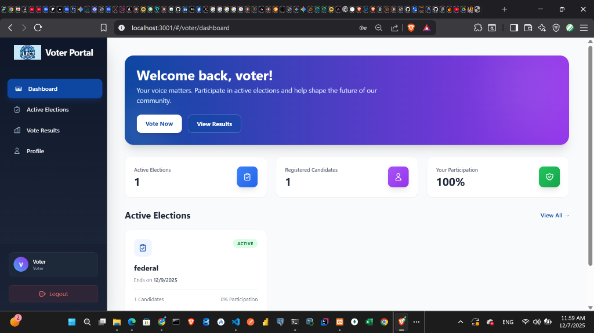 |
| *Election & User Management* | *Active Elections & History* |

| **Voter Registration** | **Active Elections** |
|:---:|:---:|
| 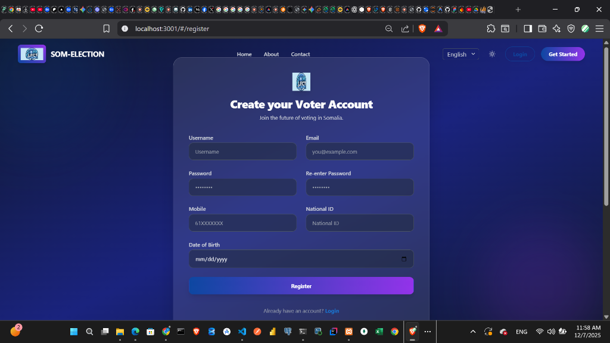 | 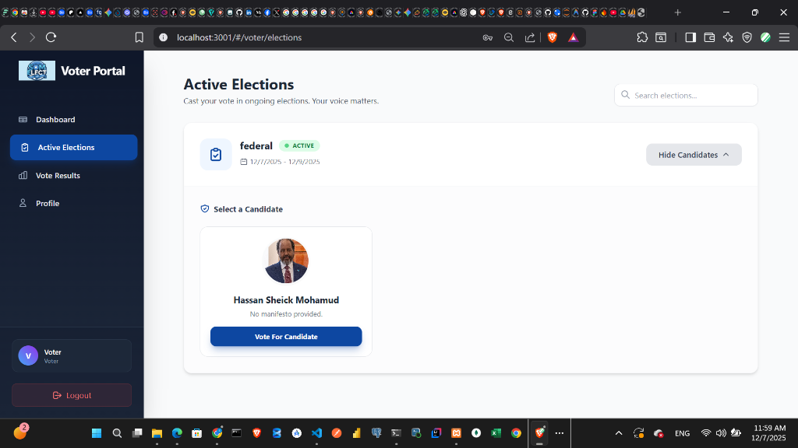 |
| *Secure Sign-up Flow* | *Real-time Voting Interface* |

| **Voter Profile** | **Vote Confirmation** |
|:---:|:---:|
| 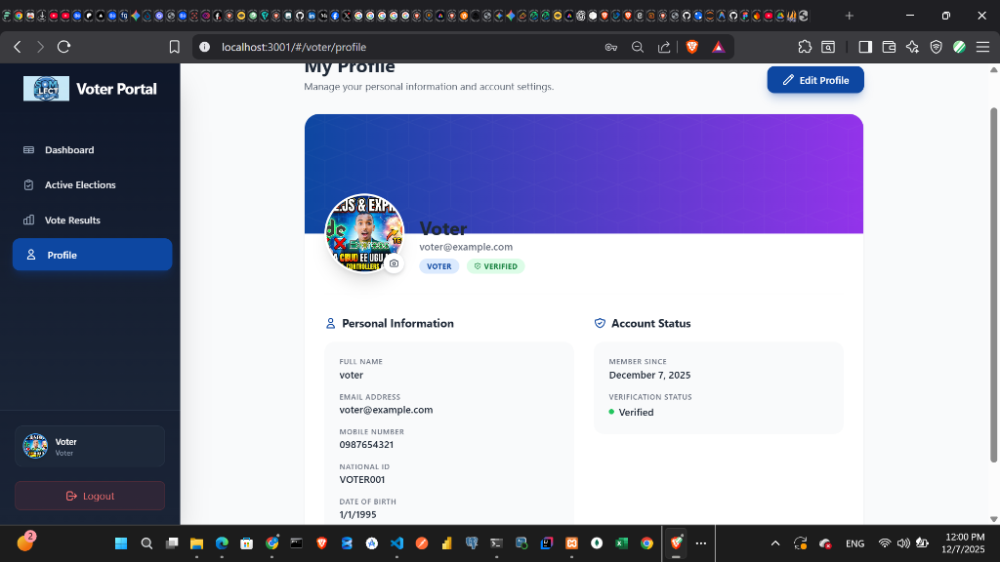 | 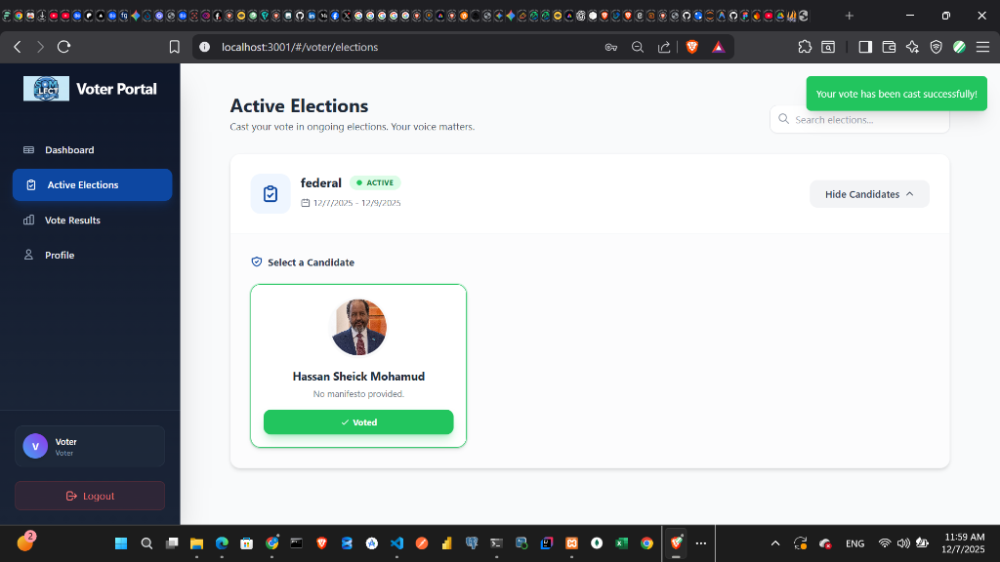 |
| *Manage Personal Info* | *Instant Feedback & Integrity* |

### Admin Management
| **Election Management** | **Candidate Management** |
|:---:|:---:|
| 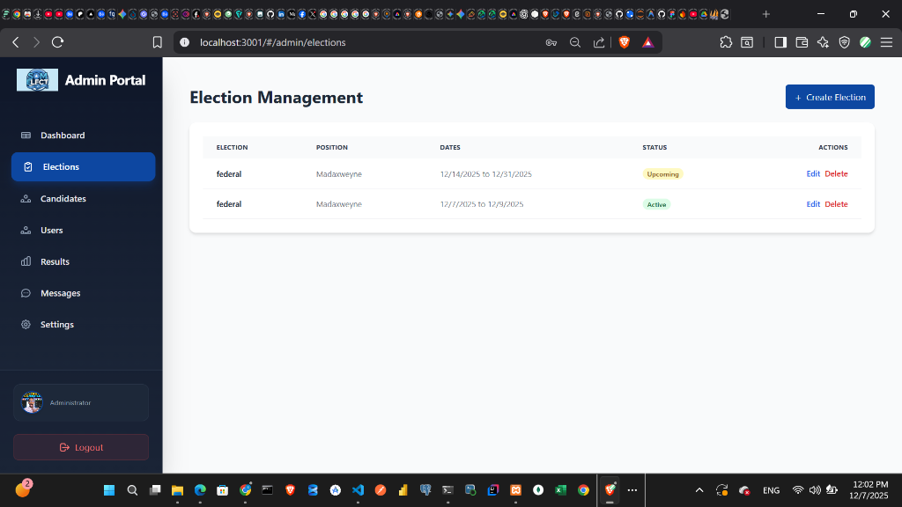 | 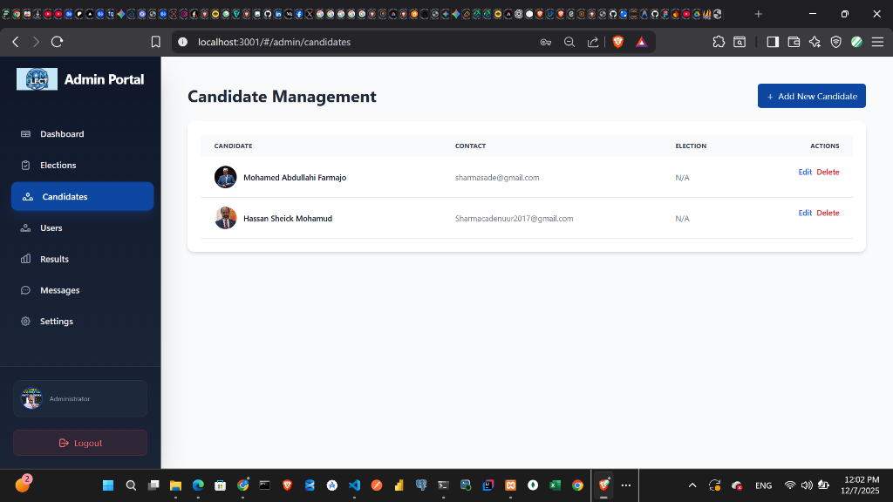 |
| *Create & Monitor Elections* | *Manage Candidates & Parties* |

| **User Management** | **Election Results** |
|:---:|:---:|
| 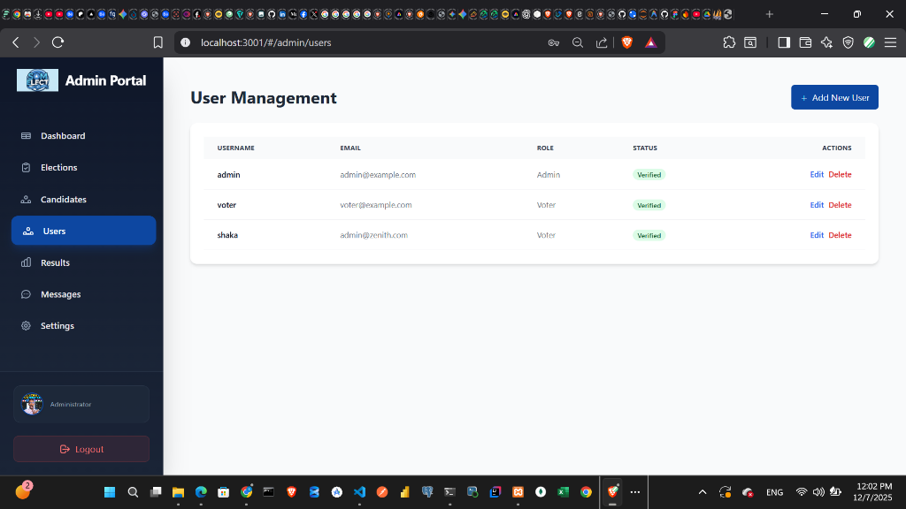 | 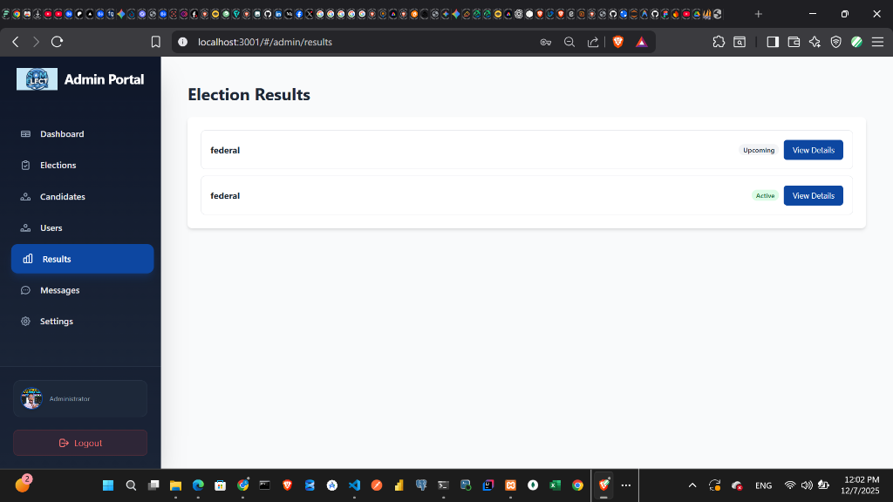 |
| *Verify Voters & Admins* | *Real-time Analytics* |

| **Message Center** | **System Settings** |
|:---:|:---:|
| 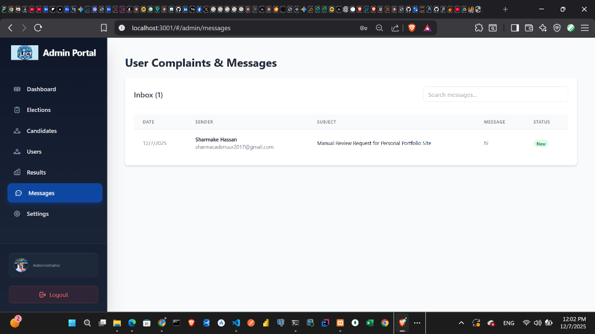 | 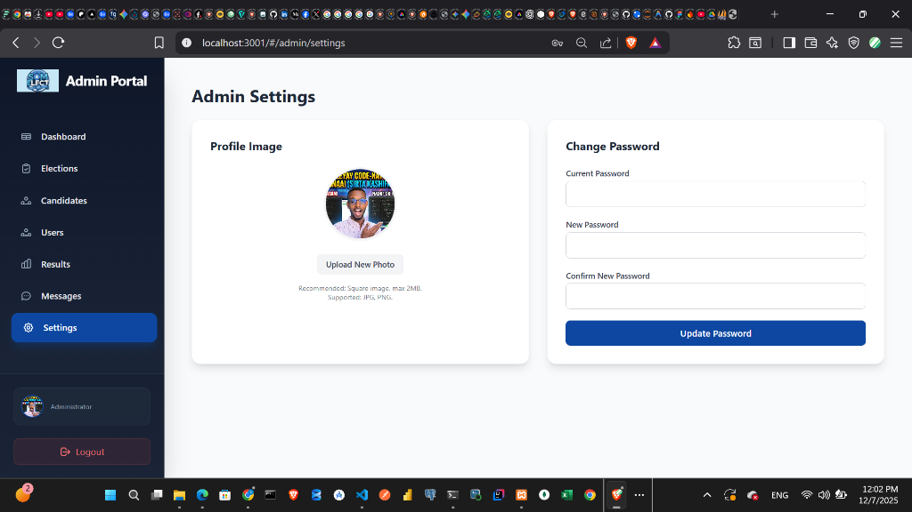 |
| *Handle Public Inquiries* | *Profile & Security Config* |

---

## 📚 Table of Contents
- [Features](#-features)
- [System Architecture](#-system-architecture)
- [Tech Stack](#-tech-stack)
- [Folder Structure](#-folder-structure)
- [Database Schema](#-database-schema)
- [API Documentation](#-api-documentation)
- [Installation & Setup](#-installation--setup)
- [Contributing](#-contributing)

---

## 🚀 Features

### 1. Public Portal (Accessible to All)
*   **Dynamic Home Page**: Features an animated hero section, live candidate showcase, and testimonials.
*   **Candidate Search**: Browse all candidates, filter by election, and view detailed profiles.
*   **Candidate Profiles**: Dedicated pages (`/candidate/:id`) showing biography, manifesto, party affiliation, and contact info.
*   **Contact System**: Integrated "Contact Us" form that sends messages directly to the Admin dashboard.
*   **Responsive Design**: Fully optimized for mobile, tablet, and desktop.

### 2. Voter Portal (Protected)
*   **Secure Registration**: Voters sign up with National ID and Mobile Number.
*   **Dashboard**: View "Active", "Upcoming", and "Completed" elections.
*   **One-Person-One-Vote**: Database constraints ensure a user can only vote once per election.
*   **Profile Management**: Update personal details and upload a profile picture.
*   **Real-time Status**: See immediate confirmation of cast votes.

### 3. Admin Portal (Protected)
*   **Dashboard Analytics**: Visual charts showing total voters, candidates, and active elections.
*   **Election Management**: CRUD (Create, Read, Update, Delete) operations for elections.
*   **Candidate Management**: Add candidates with photo uploads and link them to elections.
*   **User Management**: Monitor registered voters and verify their status.
*   **Message Center**: View and manage inquiries sent from the public contact form.
*   **Settings**: Update admin profile and system configurations.

---

## 🏗️ System Architecture

The application follows a **Client-Server Architecture**:

*   **Frontend (Client)**: A React.js Single Page Application (SPA) that consumes APIs. It handles routing, UI rendering, and user interactions.
*   **Backend (Server)**: A Node.js/Express REST API that handles business logic, authentication, and database operations.
*   **Database**: MySQL relational database storing all structured data.

---

## 🛠️ Tech Stack

### Frontend
*   **React.js (v18)**: Core library for building the UI.
*   **Vite**: Build tool for fast development and optimized production builds.
*   **Tailwind CSS**: Utility-first CSS framework for styling.
*   **Axios**: For making HTTP requests to the backend.
*   **React Router DOM**: For client-side routing.
*   **Headless UI / Heroicons**: For accessible components and icons.

### Backend
*   **Node.js**: Runtime environment.
*   **Express.js**: Web framework for building the API.
*   **Sequelize**: ORM for interacting with MySQL.
*   **MySQL2**: Database driver.
*   **JsonWebToken (JWT)**: For secure, stateless authentication.
*   **BcryptJS**: For hashing passwords.
*   **Multer**: For handling file uploads (images).

---

## 📂 Folder Structure

```
som-election/
├── backend/                # Backend Server Code
│   ├── config/             # Database configuration
│   ├── controllers/        # (Optional) Logic separation
│   ├── middleware/         # Auth & Error handling
│   ├── models/             # Sequelize Database Models
│   ├── routes/             # API Route Definitions
│   ├── uploads/            # Stored image files
│   ├── server.js           # Entry point
│   └── ER_Diagram.md       # Database Documentation
│
├── src/                    # Frontend Source Code
│   ├── components/         # Reusable UI components
│   ├── context/            # Global State (Auth, Theme)
│   ├── pages/              # Page Views
│   │   ├── admin/          # Admin Portal Pages
│   │   ├── public/         # Public Pages (Home, Login)
│   │   └── voter/          # Voter Portal Pages
│   ├── utils/              # Helper functions (API, Formatting)
│   └── App.jsx             # Main Component
│
├── public/                 # Static Assets (Logo, Favicon)
├── screenshots/            # Project Screenshots
└── README.md               # Project Documentation
```

---

## 🗄️ Database Schema

The system uses a relational database with the following core entities:

1.  **User**: Stores `username`, `email`, `password` (hashed), `nationalId`, `role` (admin/voter).
2.  **Election**: Stores `name`, `startDate`, `endDate`, `status`.
3.  **Candidate**: Stores `fullName`, `bio`, `photo`, linked to `Election`.
4.  **Vote**: Links `User` -> `Candidate` -> `Election`. Unique constraint on `(User, Election)`.
5.  **Message**: Stores `name`, `email`, `subject`, `message`.

> **Visual Diagram**: Check `backend/ER_Diagram.html` for a visual representation.

---

## 🔌 API Documentation

### Authentication
*   `POST /api/auth/register` - Register a new voter.
*   `POST /api/auth/login` - Login (Admin or Voter).
*   `POST /api/auth/reset-password` - Reset password via National ID.

### Elections
*   `GET /api/elections` - Get all elections.
*   `GET /api/elections/:id` - Get single election details.
*   `POST /api/elections` - Create election (Admin only).

### Candidates
*   `GET /api/candidates` - Get all candidates.
*   `GET /api/candidates/showcase` - Get featured candidates for Home Page.
*   `GET /api/candidates/:id` - Get full candidate profile.

### Votes
*   `POST /api/votes` - Cast a vote (Voter only).
*   `GET /api/votes/my-votes` - Get voting history.

### Messages
*   `POST /api/messages` - Send a public message.
*   `GET /api/messages` - Get all messages (Admin only).

---

## ⚙️ Installation & Setup

### Prerequisites
*   Node.js (v16 or higher)
*   MySQL Server (XAMPP, WAMP, or standalone)

### 1. Clone the Repository
```bash
git clone https://github.com/your-username/som-election-platform.git
cd som-election-platform
```

### 2. Backend Setup
1.  Navigate to the backend folder:
    ```bash
    cd backend
    ```
2.  Install dependencies:
    ```bash
    npm install
    ```
3.  Create a `.env` file in `backend/`:
    ```env
    PORT=5000
    DB_HOST=127.0.0.1
    DB_USER=root
    DB_PASSWORD=
    DB_NAME=som_election
    JWT_SECRET=your_super_secret_key_change_this
    ```
4.  Start the server:
    ```bash
    npm start
    ```
    *The database tables will be created automatically.*

### 3. Frontend Setup
1.  Open a new terminal in the root folder.
2.  Install dependencies:
    ```bash
    npm install
    ```
3.  Start the development server:
    ```bash
    npm run dev
    ```

### 4. Access the App
*   **Frontend**: Open `http://localhost:5173`
*   **Backend API**: Running at `http://localhost:5000`

---

## 🤝 Contributing
Contributions are welcome!
1.  Fork the project.
2.  Create your feature branch (`git checkout -b feature/AmazingFeature`).
3.  Commit your changes (`git commit -m 'Add some AmazingFeature'`).
4.  Push to the branch (`git push origin feature/AmazingFeature`).
5.  Open a Pull Request.

## 📄 License
Distributed under the MIT License. See `LICENSE` for more information.
