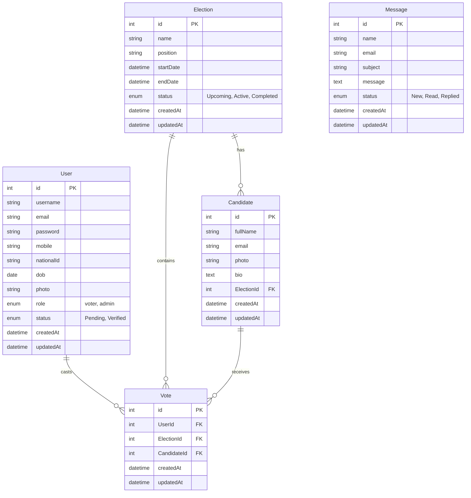

# Entity Relationship Diagram (ERD) - SOM Election

This document details the database schema and relationships for the SOM Election application.

## Schema Overview

The database consists of five main entities:
- **User**: Voters and Admins.
- **Election**: Election events.
- **Candidate**: Candidates running in elections.
- **Vote**: Votes cast by users for candidates in elections.
- **Message**: Public inquiries and complaints.

## Mermaid Diagram



## Relationships

1.  **User - Vote**: One-to-Many. A user can cast multiple votes (but only one per election, enforced by unique constraint).
2.  **Election - Candidate**: One-to-Many. An election has multiple candidates.
3.  **Election - Vote**: One-to-Many. An election has multiple votes.
4.  **Candidate - Vote**: One-to-Many. A candidate receives multiple votes.
5.  **Message**: Standalone entity for handling user inquiries.

## Constraints

-   **Unique Vote**: A unique composite index on `UserId` and `ElectionId` ensures a user can vote only once per election.
-   **Unique Email/NationalID**: Users must have unique emails and national IDs.
-   **Unique Candidate Email**: Candidates must have unique emails.

## Eraser.io / DBML Syntax

You can copy the code below and paste it directly into [Eraser.io](https://eraser.io) or a DBML renderer to generate a professional diagram.

```eraser
// Users and Auth
Table User {
  id integer [pk, increment]
  username varchar
  email varchar [unique]
  password varchar
  mobile varchar
  nationalId varchar [unique]
  dob date
  photo varchar
  role enum(voter, admin)
  status enum(Pending, Verified)
  createdAt datetime
  updatedAt datetime
}

// Election Management
Table Election {
  id integer [pk, increment]
  name varchar
  position varchar
  startDate datetime
  endDate datetime
  status enum(Upcoming, Active, Completed)
  createdAt datetime
  updatedAt datetime
}

Table Candidate {
  id integer [pk, increment]
  fullName varchar
  email varchar [unique]
  photo varchar
  bio text
  ElectionId integer [ref: > Election.id]
  createdAt datetime
  updatedAt datetime
}

// Voting Process
Table Vote {
  id integer [pk, increment]
  UserId integer [ref: > User.id]
  ElectionId integer [ref: > Election.id]
  CandidateId integer [ref: > Candidate.id]
  createdAt datetime
  updatedAt datetime
}

// Support System
Table Message {
  id integer [pk, increment]
  name varchar
  email varchar
  subject varchar
  message text
  status enum(New, Read, Replied)
  createdAt datetime
  updatedAt datetime
}
```
