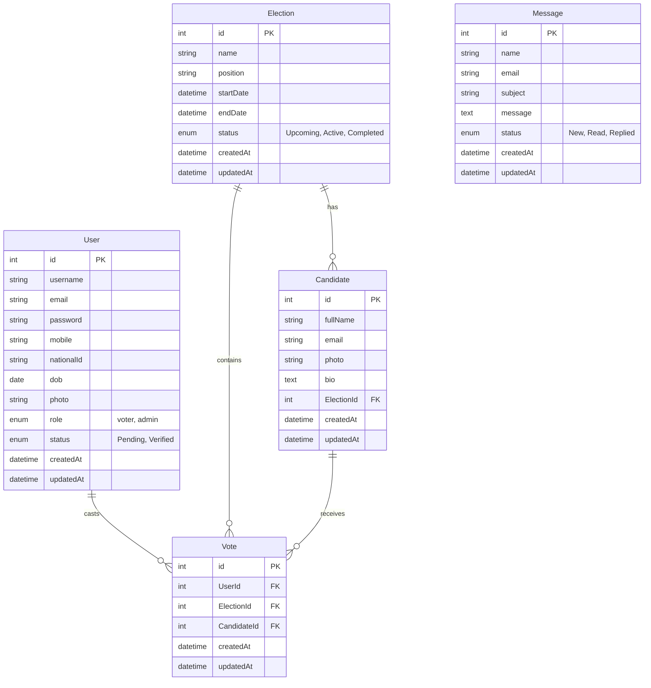

3.# Walkthrough - MySQL Migration & Admin Enhancements

## Overview
This walkthrough covers the migration from MongoDB to MySQL, the enhancement of the Admin Portal with full CRUD capabilities, a UI overhaul, and profile image management.

## Changes

### 1. Database Migration (MongoDB -> MySQL)
-   **ORM**: Switched to Sequelize.
-   **Models**: Converted `User`, `Election`, `Candidate`, `Vote` to Sequelize models.
-   **Relationships**: Defined associations (e.g., `Election hasMany Candidate`).
-   **Connection**: Configured `backend/config/database.js` to connect to local MySQL (XAMPP).

### 2. Admin Portal Enhancements
-   **CRUD Operations**:
    -   **Candidates**: Full Create, Read, Update, Delete support with image uploads.
    -   **Elections**: Full CRUD support.
    -   **Users**: [NEW] Added Create and Edit functionality for managing voters and admins.
-   **UI Overhaul**:
    -   **Dashboard**: Modernized with gradient cards, better typography, and improved charts.
    -   **Layout**: Enhanced sidebar with gradients and glassmorphism effects.
-   **Profile Settings**:
    -   **Image Upload**: Admins can now upload and update their profile picture in Settings.
    -   **Sidebar Display**: The uploaded profile picture is displayed in the sidebar.

### 4. Public UI Overhaul
-   **Unified Login**: Created a single, professional login page for both Admins and Voters with a modern gradient design.
-   **Home Page**:
    -   **Hero Section**: Added an animated hero section with a call to action.
    -   **Candidate Showcase**: Displays real candidates fetched from the backend with hover effects.
    -   **Testimonials**: Added a section for social proof.
-   **Layout**:
    -   **Header**: Implemented a sticky, glassmorphism navbar.
    -   **Footer**: Redesigned with a professional dark theme and social links.

## Verification Results

### Manual Verification
-   **Database**: Confirmed tables are created and data is seeded.
-   **Admin Portal**:
    -   Verified Candidate/Election/User CRUD.
    -   Verified Admin Profile Image upload and display.
    -   Verified Image uploads are saved to `uploads/` and served correctly.
-   **Public Portal**:
    -   Verified Unified Login works for both roles.
    -   Verified Home Page animations and candidate data fetching.
    -   Verified Responsive Layout (Header/Footer).
-   **Voter Portal**: Verified voters can view active elections and cast votes.

### Automated Tests
-   N/A (Manual verification performed).

## Database Schema (ER Diagram)

The following diagram illustrates the relationships between the database entities, including the new **Message** system.

